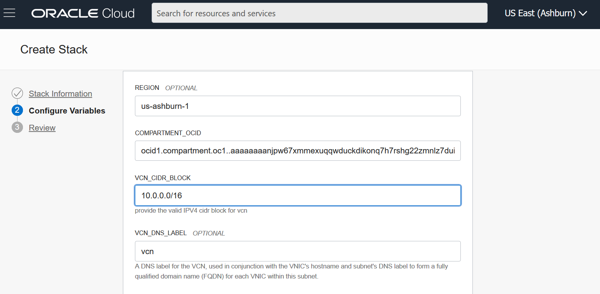
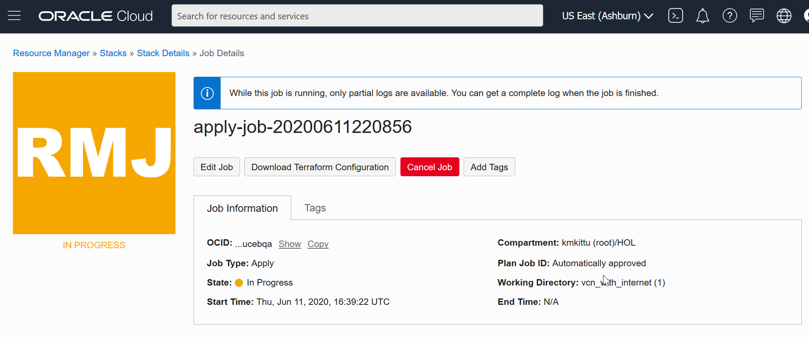
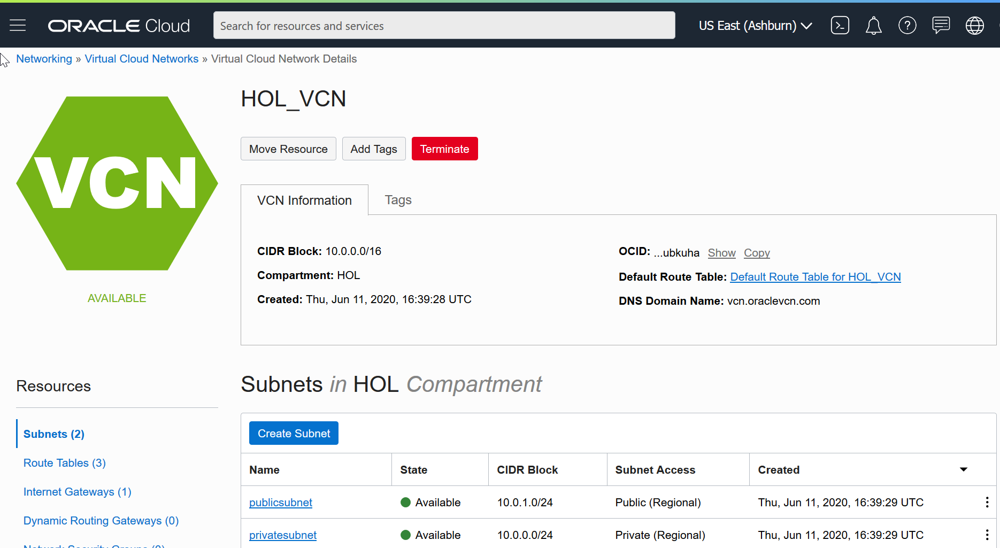
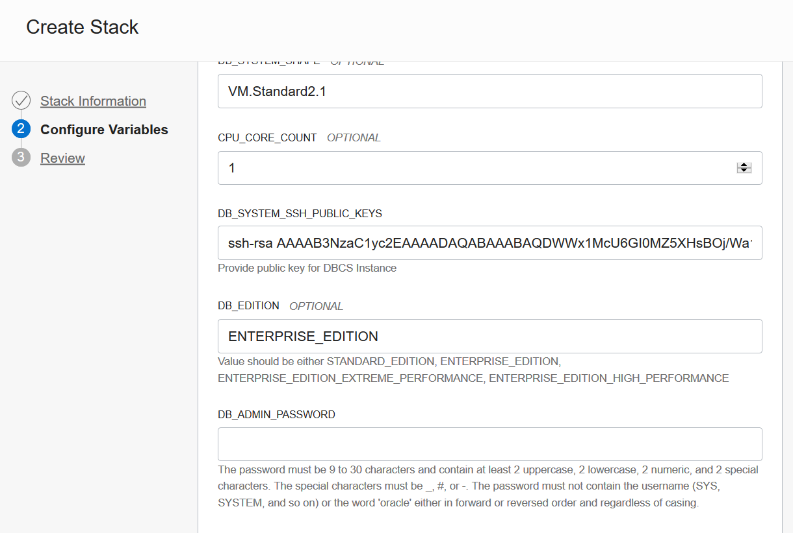

# OCI Cloud Native Services Workshops and HOL

## 

## Introduction

This lab will show you how to setup a Oracle Cloud network (VCN) and a compute VM instance and a Database Cloud Service running a Oracle Database install using Oracle Resource Manager and Terraform. 

## Prerequisites

1) To run these labs you will need access to an Oracle Cloud Account.  We have prepared this lab for the following situations: 

- <u>You are using your own Oracle Cloud Tenancy,</u> either via a **Free Tier**, using a **Pay-as-you-Go** account, or using the **Corporate account** of your organization.  If you do not have an account yet, you can obtain  an Oracle Free Tier account by [clicking here.](https://myservices.us.oraclecloud.com/mycloud/signup?language=en&sourceType=:ow:o:p:feb:0916FreePageMidButton&intcmp=:ow:o:p:feb:0916FreePageMidButton)

2) Create SSH Keys. It will create Public and Private key.

  Next, follow the steps described on respective section.

#### [License](../../LICENSE)

Copyright (c) 2014, 2020 Oracle and/or its affiliates
The Universal Permissive License (UPL), Version 1.0

### About Terraform and Oracle Cloud Resource Manager
Terraform is a tool for building, changing, and versioning infrastructure safely and efficiently. Configuration files describe to Terraform the components needed to run a single application or your entire data center. In this lab a configuration file has been created for you to build network and compute components. 
Resource Manager is an Oracle Cloud Infrastructure service that allows you to automate the process of provisioning your Oracle Cloud Infrastructure resources. Using Terraform, Resource Manager helps you install, configure, and manage resources through the "infrastructure-as-code" model. To learn more about OCI Resource Manager, take a watch the video below.

## Lab 1 : VCN (Virutal Cloud Network) creation

### Step 1: Login and Create Stack using Resource Manager
1.	Click on the link below to download the Resource Manager zip file you need to build your enviornment.
o	 [Download VCN_Creation.zip](https://github.com/kmkittu/HOL/raw/master/code/VCN_Creation.zip) - Packaged terraform VCN creation script. 

2.	Save in your downloads folder.

3. Login into the Cloud account 

4.	Open up the hamburger menu in the left hand corner. Choose the compartment in which you would like to install. In this example we choose HOL compartment. Choose Resource Manager > Stacks.

5. Stack page will appear. Click Create stack button

6. Stack page will appear. First page will collect stack information. Drop the VCN_Creation.zip file for the Terraform configuration file. Also provide the name for this stack.

7. Provide Description and the compartment name on which this stack has to be created and click to next page

8. Next page is for configuring variables. Region and Compartment OCID values will be collected automatically using the logged in credentials. It can be changed if required. Provide values for VCN CIDR block, VCN DNS label, VCN Display name, CIDR block for Public subnet, DNS label and Display name for Public subnet CIDR block for Private subnet, DNS label and Display name for Private subnet.

Click Next button. Next page is for review.

Review all the variable and click Create.

It will create Stack at the mentioned compartment.

9. Its time to validate the Stack. Click "Terraform Actions" in stack as shown in the picture. Click Plan under "Terraform Actions".

10. Terraform plan window will appear. It will have the plan name and optional tagging.

Click Plan.

11. Plan execution page will appear. The Plan logo will be shown in Yellow color till it gets executed. 

Once the execution is completed, the color will change to green.

Reiew the log after completion. If it has completed successfully, we can go for Apply action.

Click Apply

12. Apply page will appear. We need to enter Plan name and optional tagging.

The Apply page logo will be shown in Yellow color till it gets executed. 

Once the execution is completed, the color will change to green.

Reiew the log after completion. If there are no errors, it means VCN has been created successfully.

We good see HOL_VCN has been created successfully in our compartment.

Click HOL_VCN and observe all networking components including subnets.

## LAB2 - Compute Instance creation

In this lab we will create a Compute Linux VM instance on the VCN that we have created in Lab1.

1.	Click on the link below to download the Resource Manager zip file you need to build your enviornment.
o	 [Download Compute_Instance.zip](https://github.com/kmkittu/HOL/raw/master/code/Compute_Instance.zip) - Packaged terraform VCN creation script. 

2.	Save in your downloads folder.

3. Login into the Cloud account 

4.	Open up the hamburger menu in the left hand corner. Choose the compartment in which you would like to install. In this example we choose HOL compartment. Choose Resource Manager > Stacks.

5. Stack page will appear. Click Create stack button

6. Stack page will appear. First page will collect stack information. Drop the Compute_Instance.zip file for the Terraform configuration file. Also provide the name for this stack.

Mention the compartment at which this VM to be created and click Next

Configure all the variables required for Compute Instance creation.  Region and Compartment OCID values will be collected automatically using the logged in credentials. Specify VCN Display name as "HOL_VCN", it is the VCN created in Lab1. Specify public subnet displayname as 'publicsubnet', the subnet got created in Lab1. If you want to create compute VM in private subnet, specify the private subnet ("privatesubnet") created in Lab1.

Instance_Image_OCID is an optional field and will be retrieved automatically. Specify Instance name and Public keys required for authenticating this compute instance

Specify Boot volume Size and required shape for the VM. Click Radio button to assign Public IP to this compute Instance.

Next page is to review all the attribute of compute VM.

Click Create to create the stack with the specified attributes. The slack page will be opened, click the Terraform actions and plan.

Plan window will be opened. Provide value for name and click Plan.

Once plan is completed successfully, click Apply from "Terraform Actions" button

Apply window will be opened. Provide value for name and click Apply 

Once the apply job completed successfully, check the logs.

Once again Open up the hamburger menu in the left hand corner. Click the Instances button.

We could see the instance has been created and status is running.

Click the created instances and check the details

## Lab3: DBCS instance creation

In this lab we will create a Compute Linux VM instance on the VCN that we have created in Lab1.

1.	Click on the link below to download the Resource Manager zip file you need to build your enviornment.
o	 [Download DBSystem.zip](https://github.com/kmkittu/HOL/raw/master/code/DBSystem.zip) - Packaged terraform VCN creation script. 

2.	Save in your downloads folder.

3. Login into the Cloud account 

4.	Open up the hamburger menu in the left hand corner. Choose the compartment in which you would like to install. In this example we choose HOL compartment. Choose Resource Manager > Stacks.

5. Stack page will appear. Click Create stack button

6. Stack page will appear. First page will collect stack information. Drop the DBSystem.zip file to the Terraform configuration file box as shown in the picture. Also provide the name for this stack.

7. Specify the compartment at which this stack has to be created and click Next button

8. The next page will look for Configuration variables. Some parameters are optional. If we don't Region and Compartment OCID will be collected from the current login credentials and displayed in the respective text boxes. If we need to change, we can specify the approproiate values. Specify existing VCN name (HOL_VCN got created in Lab1) on which this DBCS instance will be created. Also specify existing subnet name (either publicsubnet or privatesubnet), DBsystem shape.

 We have to specify some additional configurations. CPU core count, SSH Public key, Database edition, DB Admin password (Sys, system user password) 

Specify DB Name, Database version, DB Home Display name, Hostname, Characterset and  National characterset

Also specify the workload type, Pluggable database (PDB) name, Datastorage size and License model needs to be mentioned. 

Specify node count, If it is single instance then the node count will be 1. Click Next button

Next page will be the review. Check all the specified variables. If everything looks good click 'create'.

In the stack page, click 'Plan' to execute the Terraform plan. Specify the plan name and click Plan button.

Once plan is executed successfully, it is ready for apply.

The apply would take time since it has to create VM instance and then install database software and create database on top of that.
Also it has to configure cloud tools for the database.

Open up the hamburger menu in the left hand corner. Choose "Bare Metal,VM and Exadata".

The DB Systems page will be displayed along with the database that we had created.

Click on the database to see details about the instance

And details about the database

This denotes the DBCS instance is successfully created at the specified VCN.

